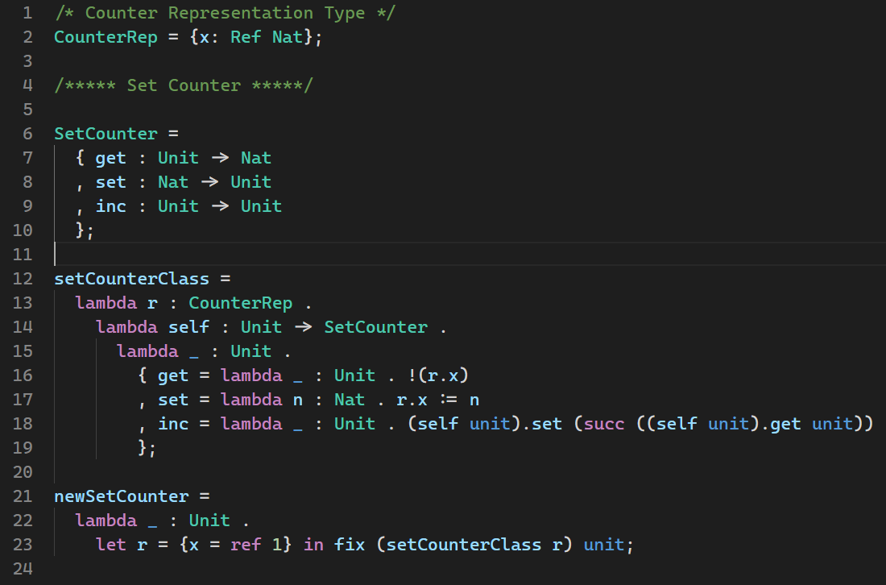
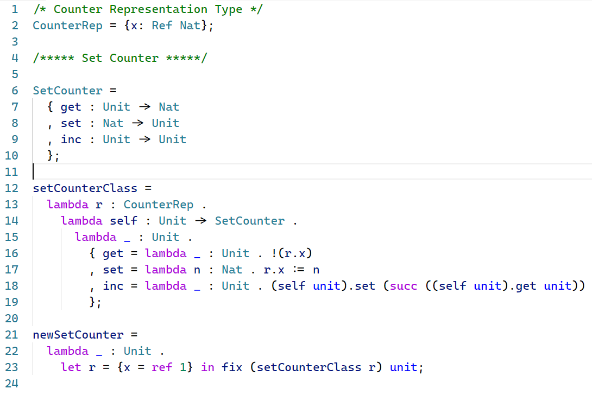

# Simply-Typed Lambda Calculus

[](https://www.gnu.org/licenses/agpl-3.0.html)

This is a language extension for simply-typed lambda calculus implemented in *Types and Programming Languages* by Pierce. It is licensed under GNU Affero General Public License Version 3.

## Features

Syntax highlighting. Below are screenshots using Dark+/Light+ themes.

### Dark+



### Light+



## Install

Unfortunately, this extension is currently not published in VSCode market. To install this extension, you can clone this repository to the extensions folder of your VSCode installation.

```bash
git clone git://github.com/Krantz-XRF/vscode-stlc /path/to/vscode/extensions/vscode-stlc
```

According to [the VSCode documentation](https://code.visualstudio.com/docs/editor/extension-gallery#_where-are-extensions-installed):

> Extensions are installed in a per user extensions folder. Depending on your platform, the location is in the following folder:
>
> - **Windows** `%USERPROFILE%\.vscode\extensions`
> - **macOS** `~/.vscode/extensions`
> - **Linux** `~/.vscode/extensions`
>
> You can change the location by launching VS Code with the `--extensions-dir <dir>` command-line option.

## Feature Request or Bug Report

Please see the [GitHub repository](https://github.com/Krantz-XRF/vscode-stlc).
